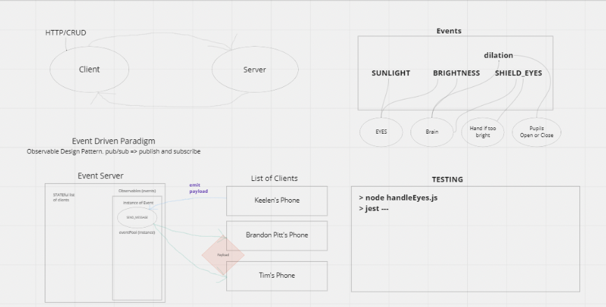

# caps LAB 11

* As a vendor, I want to alert the system when I have a package to be picked up.
* As a driver, I want to be notified when there is a package to be delivered.
* As a driver, I want to alert the system when I have picked up a package and it is in transit.
* As a driver, I want to alert the system when a package has been delivered.
* As a vendor, I want to be notified when my package has been delivered.

## Author: Stephen Martinez

## Set up

## Test

* `npm test`

* `node hub.js`

## Links

* [PR](https://github.com/SdMartinez13/caps/pull/1)
* [Repo](https://github.com/SdMartinez13/caps)

## UML

* Class UML

# caps LAB 12

* As a vendor, I want to alert the system when I have a package to be picked up.
* As a driver, I want to be notified when there is a package to be delivered.
* As a driver, I want to alert the system when I have picked up a package and it is in transit.
* As a driver, I want to alert the system when a package has been delivered.
* As a vendor, I want to be notified when my package has been delivered.

## Author: Stephen Martinez

## Set up

## Test

* `node`

## Links

* [PR](https://github.com/SdMartinez13/caps/pull/2)
* [Repo](https://github.com/SdMartinez13/caps)

## UML

* Class UML

